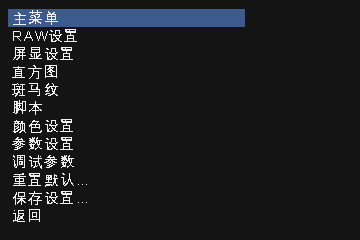
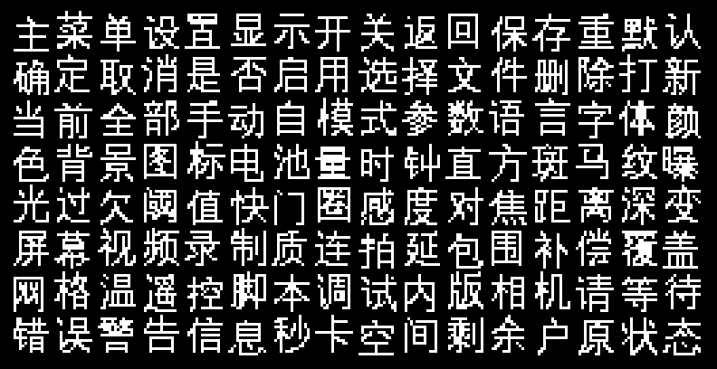

# CHDK 1.6.1 简体中文菜单（IXUS 95 / SD1200）

Canon IXUS 95 IS（SD1200 IS）上 **CHDK 1.6.1** 的 ALT 菜单汉化包。  
只翻译 CHDK 菜单，**不会改相机自己的中文菜单**。

[下载现成压缩包](https://github.com/jy-encore/chdk-ixus95-zh/releases/latest)



## 为什么是两个文件

CHDK 1.6.1 内置字体没有汉字。只放语言文件，菜单会是乱码。  
必须同时使用 `chinese.rbf`。这个语言文件不是 UTF-8，也不是 GBK，离开这套字体就不能用。

字库存得下 128 个汉字，所以菜单用词比较短。  
GPS、EyeFi、游戏细节和一部分调试项仍是英文。



## 怎么复制到 SD 卡

下载 [IXUS95-CHDK161-简体中文菜单.zip](IXUS95-CHDK161-简体中文菜单.zip)，把里面的 `CHDK` 文件夹复制到 SD 卡根目录，选择合并。  
不要删掉卡里原来的 `DISKBOOT.BIN`、`PS.FI2`，以及其他 CHDK 文件。

复制后应有：

```text
SD卡/CHDK/LANG/chinese.lng
SD卡/CHDK/FONTS/chinese.rbf
```

## 第一次怎么打开（这时菜单还是英文）

IXUS 95 进入 ALT：按一下播放键 `[>]`，再按 `MENU`。

```text
CHDK Settings
  -> Menu Settings
    -> Language & Fonts
       Language...        选择 chinese.lng
       Menu RBF Font...   选择 chinese.rbf
```

返回，选 **Save Options Now...**

两项都要选。只选语言、不选字体，汉字会乱码。保存之后下次开机会记住。

如果某条屏显变成乱码：屏显仍走内置英文字体，和菜单字体不是同一套。  
菜单看不清时，把字体改回原来的 RBF（或随便点一个不能当字体的文件以恢复内置字体），菜单会回到英文，拍摄功能不受影响。

## 说明

- 按 CHDK 1.6.1 的字符串表制作（英文原文来自 1.6.1-6355）。
- IXUS 95 有 1.00B 和 1.00C 两种固件。语言文件两种都能用，但 `DISKBOOT.BIN` / `PS.FI2` 必须和相机固件版本一致。
- 非官方翻译，与 CHDK 项目无关。CHDK 本体请从 [chdk.fandom.com](https://chdk.fandom.com/) 获取。
